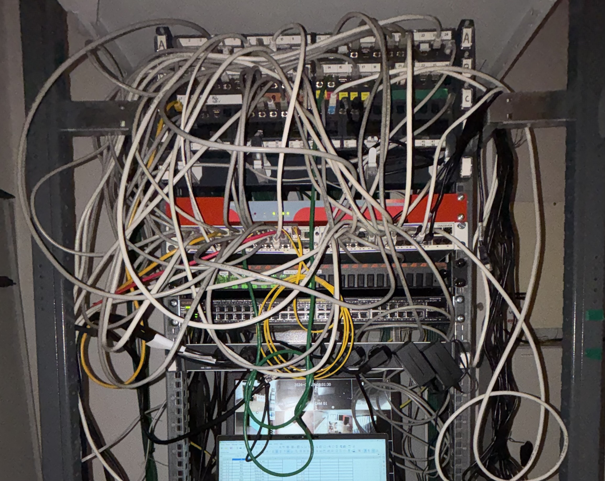
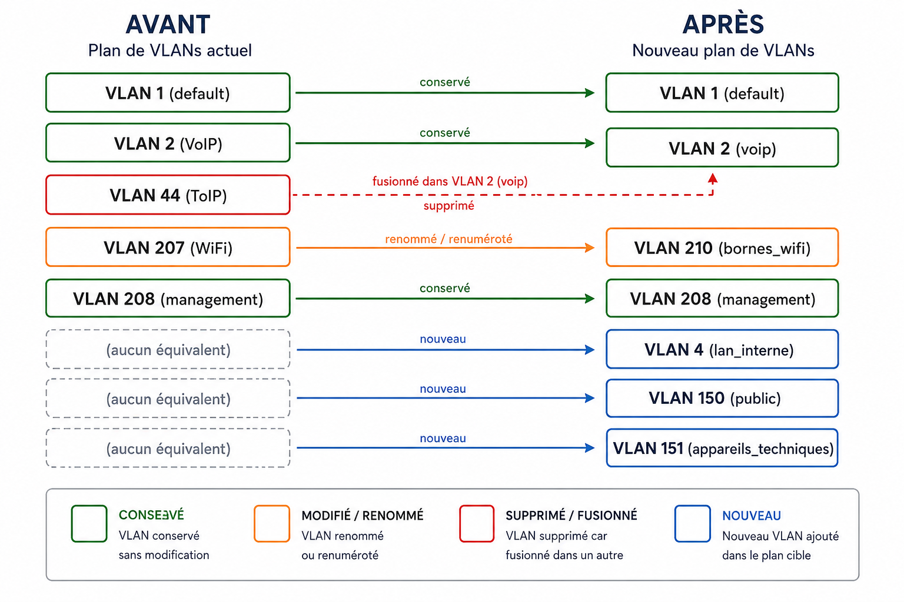
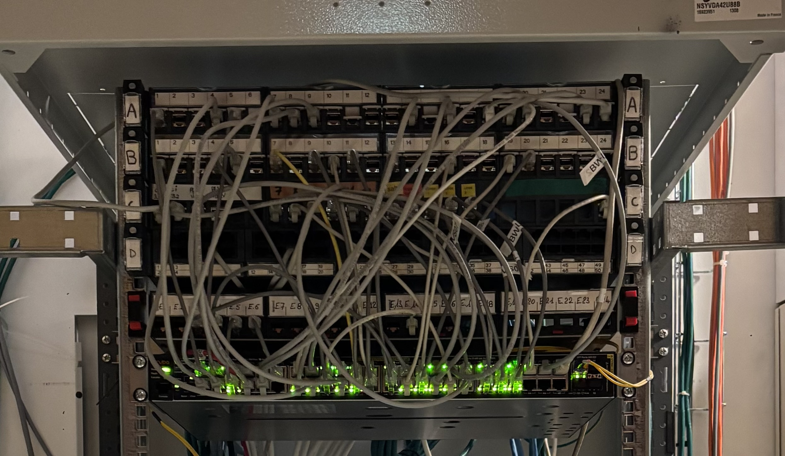

# Étapes du projet — Migration switch


Ce document détaille le déroulé chronologique de la migration, illustré par les photos prises avant et après l'intervention.

---

## Étape 1 — Repérage et réorganisation du câblage réseau

Face à un câblage initial réalisé "au fil de l'eau" et devenu peu lisible, un **tableau de correspondance** a été mis en place. Celui-ci permet de :

- lier chaque port de l'ancien switch à sa prise murale correspondante,
- identifier le VLAN actif sur chaque port,
- planifier un nouveau branchement propre et ordonné en assignant à chaque prise un nouveau port sur le nouveau matériel.

> [!NOTE]
> Le tableau de repérage complet est disponible en annexe (`images/tableau-correspondance.xlsx` ou équivalent).

**📷 Baie informatique — AVANT intervention**



---

## Étape 2 — Repérage des VLANs existants

Repérage des VLANs actifs sur l'ancien switch à l'aide de **LibreNMS**, en complément du tableau de correspondance établi à l'étape 1.

---

## Étape 3 — Configuration du nouveau switch (en SSH)

Le switch Aruba 2530 étant déjà présent sur site mais non opérationnel (pas d'IP de management configurée, SSH non activé par défaut), une première connexion **physique** a été nécessaire avant de pouvoir l'administrer à distance.
 
**Connexion initiale en local :**
 
- Branchement d'un câble console (RJ45/USB) entre le switch et mon poste, pour accéder à la CLI en direct sans dépendre du réseau.
- Attribution d'une IP de management au switch (sur le VLAN d'administration), afin de pouvoir le joindre ensuite depuis le réseau.
- Activation de l'accès SSH (génération des clés, création d'un compte d'administration).
- 
**Bascule en SSH — le reste de la configuration a ensuite été mené à distance :**
 
- Création des VLANs
- Taggage des VLANs sur les différents ports
- Attribution d'un nom d'hôte au switch
  
> [!NOTE]
> Cette étape illustre un principe classique en administration réseau : un équipement "nu" n'est **jamais** administrable en SSH dès la sortie de carton, il faut d'abord une première connexion locale (console ou port dédié) pour lui donner une IP et activer les accès distants. Le détail des commandes utilisées est disponible dans **[PROCEDURE.md](./PROCEDURE.md)**.
---

## Étape 4 — Raccordement de la liaison fibre

Connexion de la fibre au switch, avec création du **VLAN 208** (`management`) et taggage de ce dernier sur le port dédié à la liaison  c'est ce taggage qui permet au trafic d'administration (SSH, remontée LibreNMS) de transiter sur cette fibre jusqu'au reste de l'infrastructure. Sans ce VLAN taggué sur le bon port, le switch resterait administrable uniquement en local, ce qui aurait obligé à un déplacement sur site à chaque intervention.

---

## Étape 5 — Mise à jour du plan de VLANs

La migration a été l'occasion de nettoyer et d'harmoniser le plan de VLANs du site : certains VLANs historiques ont été conservés, d'autres fusionnés ou renumérotés, et trois nouveaux VLANs ont été créés pour anticiper des besoins à venir.

Le VLAN 1 (default), le VLAN 2 (voip) et le VLAN 208 (management) ont été conservés sans modification. L'ancien VLAN 44 (ToIP) a été supprimé et fusionné dans le VLAN 2 voip. Le VLAN WiFi, historiquement le 207, a été renommé et renuméroté en VLAN 210 (bornes_wifi). Enfin, trois VLANs ont été créés : le 4 (lan_interne), le 150 (public) et le 151 (appareils_techniques).

[!IMPORTANT]
Sur les trois VLANs créés, seul le VLAN 4 (lan_interne) est actuellement taggué sur un port (le photocopieur). Les VLANs 150 (public) et 151 (appareils_techniques) restent en attente, sans port taggué, en prévision de besoins à venir.
 
**📷 Schéma récapitulatif du plan de VLANs**


 

---

## Étape 6 — Mise en service du nouveau switch

Bascule du câblage de l'ancien switch vers le nouveau switch Aruba, port par port, en suivant le tableau de correspondance établi à l'étape 1.

> [!IMPORTANT]
> La bascule a été réalisée de manière à **garantir une continuité de service pendant les horaires d'ouverture du site au public**.

**📷 Baie informatique — APRÈS intervention**



---

## Étape 7 — Mise à jour de la supervision et de la documentation

Mise à jour de **LibreNMS** et de la documentation technique associée pour refléter le nouvel équipement et le nouveau plan de VLANs.

---

## Étape 8 — Réaménagement de la banque d'accueil

Gestion du débranchement puis du rebranchement des équipements de la banque d'accueil, dans le cadre du réaménagement de cet espace.

**📷 Banque d'accueil — AVANT**

``

**📷 Banque d'accueil — APRÈS**

``

---

## Étape 9 — Vérifications post-migration

Une fois la bascule effectuée, une série de contrôles a permis de confirmer que le nouveau switch fonctionnait correctement avant de considérer la migration terminée :

- **Vérification de l'état des VLANs et des ports** :
  ```
  show vlan brief
  show interfaces brief
  ```
  → confirmation que chaque port actif est bien rattaché au bon VLAN (comparaison avec le tableau de correspondance de l'étape 1).

- **Tests de connectivité (ping)** depuis un poste de chaque VLAN critique vers sa passerelle, à titre d'exemple :
  ```
  ping 192.0.2.1     ! passerelle VLAN voip
  ping 192.0.2.1     ! passerelle VLAN management
  ```
  *(adresses données à titre d'exemple, anonymisées)*

- **Vérification à distance** : connexion SSH au switch depuis l'extérieur du site, pour confirmer qu'il reste administrable sans déplacement physique.

- **Contrôle dans LibreNMS** : apparition du nouvel équipement dans la supervision, avec remontée correcte des métriques (trafic par port, état des liens).

> [!NOTE]
> Aucune anomalie n'a été relevée lors de ces vérifications. Le tableau de correspondance de l'étape 1 a servi de référence tout au long de ce contrôle, port par port.

---

## Résultats

- Mise en production réussie, sans coupure de service pendant les horaires d'ouverture
- Baie clarifiée, câblage réorganisé et étiqueté
- Plan de VLANs harmonisé
- Supervision et documentation à jour
- Réaménagement mené sans incident
- Fonctionnement du nouveau switch confirmé par des vérifications post-migration (VLANs, connectivité, supervision)
